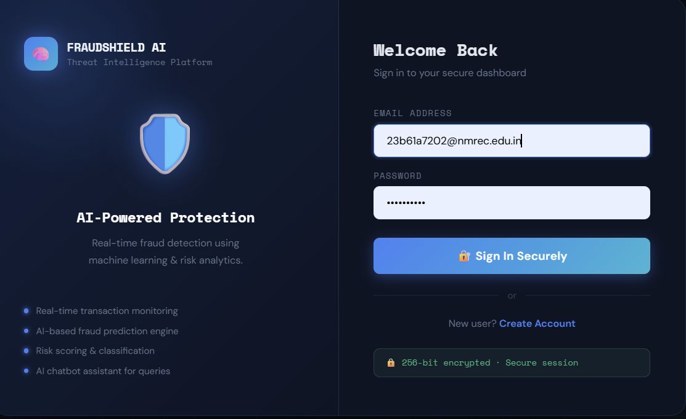
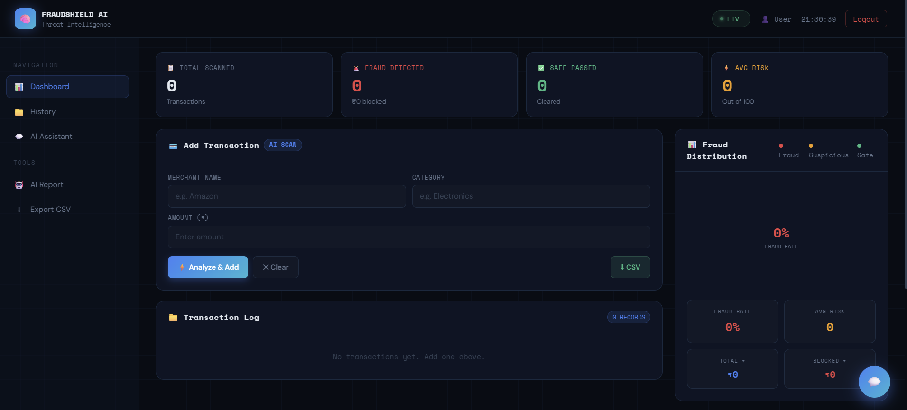
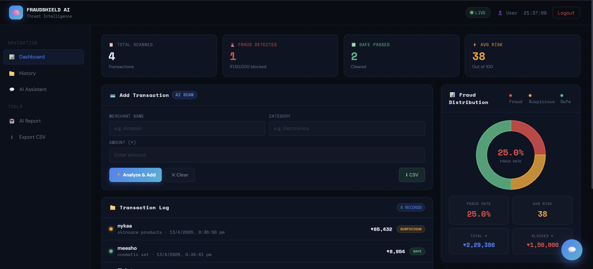
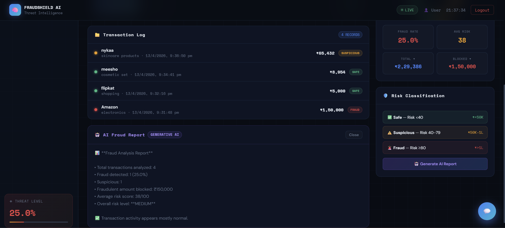
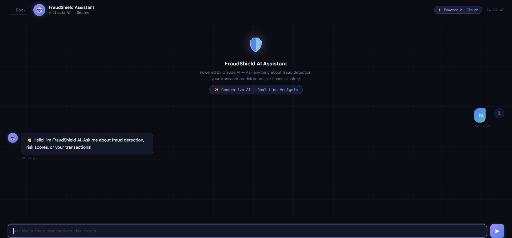

<h1 align="center">🛡️ AI Fraud Detection System</h1>

<p align="center">
AI-powered fraud detection web application using Machine Learning and Flask
</p>

---

# 🚀 Features

✅ Fraud Transaction Detection  
✅ AI-based Pattern Analysis  
✅ Secure Login System  
✅ Transaction History  
✅ Smart Dashboard  
✅ Real-time Prediction  

---

# 🛠️ Technologies Used

- Python
- Flask
- Machine Learning
- HTML/CSS
- JavaScript
- Scikit-learn

---

# 📸 Project Screenshots

## 🏠 Home Page



---

## 📊 Dashboard



---


##  Upload Page



---

## Result Page



---

## Chatbot Assistant



---

# ⚙️ Installation

```bash
git clone https://github.com/your-username/ai-detection.git
cd ai-detection
pip install -r requirements.txt
python app.py
```

---

# 👨‍💻 Project Team

| Name |
|------|
| Gayathri Chowdary | 
| Siri Chandana | 
| Dinesh Karthik | 
| Madhu |
